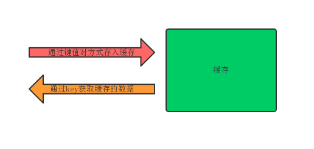
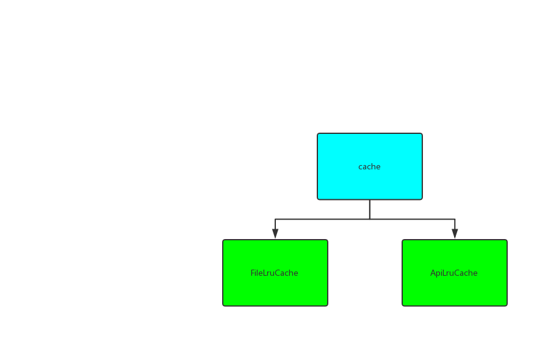

# 皓月缓存库
皓月缓存库是基于数据库的方式通过简便的调用方式实现缓存的快速读取与插入操作，如果超过缓存库的容量，缓存库采用的策略是LRU。



# 1.快速集成
## 1.1 Gradle
 ```api "com.meili.moon.sdk:cache:x.x.x" ```
## 1.2 初始化
在application的onCreate()方法中进行初始化环境
```java
class DemoApp : Application() {
    override fun onCreate() {
        super.onCreate()
        MoonCacheImpl.init(this)
    }
}
```
注：如果项目中引入了整体皓月库，则不需要在单独初始化。
# 2.使用方式
缓存库的缓存方式分为两种，一种是缓存字符串，一种是缓存文件。


## 2.1. Api缓存
我们在使用缓存时，通常是要将需要缓存的内容存入，需要读取缓存的时候去读取。
```java
val cache = MoonCacheImpl.getCache()
//将内容缓存起来
cache.put("cache","缓存的内容")
//读取缓存的内容
 val cache = cache.getValue("cache")
```
## 2.2. 文件缓存
```java
val fileCache = MoonCacheImpl.getFileCache()
//将文件缓存起来
fileCache.put("fileCache", File(filePath))
//读取缓存的文件
val cache = fileCache.getValue("fileCache")
```
# 3. 高级特性
除了基本的使用，还包括配置缓存的最大条数，文件缓存的最大磁盘空间，清除缓存等功能
## 3.1 配置最大缓存数，最大的磁盘空间
配置不是必须的，如果不配置，缓存库会为你提供默认的缓存数，默认的缓存数为5000，文件缓存的最大磁盘空间为100M，如果你觉得并不适合你的程序，我们提供了自定义设置，如下：
```java
 cache.configGlobal(object : DiskCache.Config {
                 /**缓存最大条数*/
                override var cacheMaxCount: Int = 500
                /**文件缓存的最大磁盘空间，单位：字节*/
                override var cacheMaxFileSize: Long = 10 * 1024 * 1024L
            })
```
## 3.2 通过key清除缓存
我们在存储缓存的时候是通过键值对方式存储，我们也可以通过key去删除这条缓存
```java
val cache = MoonCacheImpl.getCache()
cache.remove("cache")
```
## 3.3 清除缓存
缓存分为两类缓存，一类是文件缓存，一类是字符串缓存，如果你想单独清除哪一类的缓存，可以使用`clear()`
```java
val fileCache = MoonCacheImpl.getFileCache()
//清除文件的缓存
fileCache.clear()
val cache = MoonCacheImpl.getCache()
//清楚字符串的缓存
cache.clear()
```
## 3.4 清除全部缓存
在我们开发项目时，如果你想清楚全部缓存可以使用`clearAll()`，无论哪个谁调用都是清除全部缓存。
```java
val fileCache = MoonCacheImpl.getFileCache()
//清除全部缓存
fileCache.clearAll()
val cache = MoonCacheImpl.getCache()
//清楚全部缓存
cache.clearAll()
```