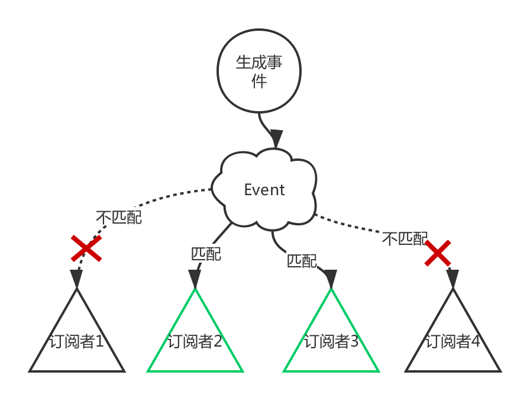
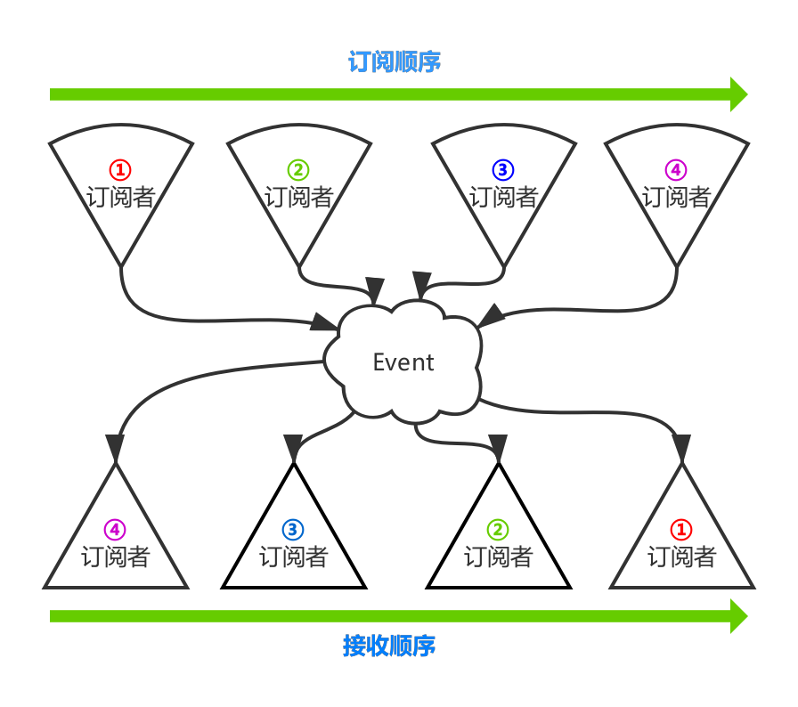
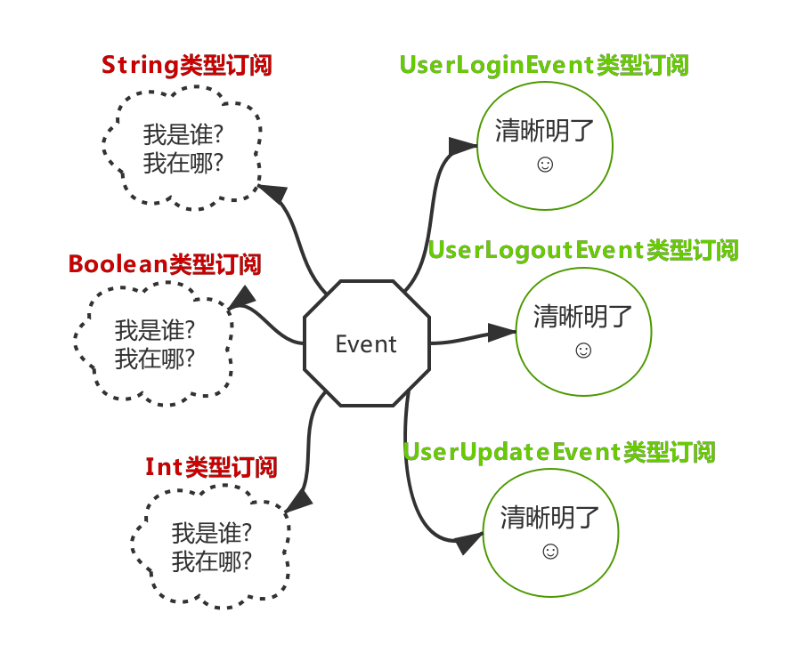

# Event
皓月有自己的一个轻量级事件订阅库，主要用在页面间事件订阅，他就是我们这里要讨论的Event库。Event库主要功能是将事件分发给匹配事件的订阅者，如图：



## 1. 快速集成
Event库由于实现很轻量，所以抽象和实现都在kit库中，引入kit库就集成了Event功能。具体kit库的引入方式请参见：[kit引入文档](/../kit/kit_import.md)

-------

## 2. 使用方式
Event的使用分两部分：订阅事件和发送事件。所有功能都由`CommonSdk.event()`提供。
### 2.1. 订阅事件
**第一步**：将需要接收事件的实例在Event库上进行注册
```kotlin
CommonSdk.event().register(this)
```
> 一般此方法放到基类的onCreate中，用来作为当前类的统一注册方式。和此类对应的方法为注销方法，当类退出时进行调用释放资源，如：CommonSdk.event().unregister(this)

**第二步**：添加事件订阅方法

Event库支持以注解的方式添加事件订阅。订阅事件类型由注解方法的入参类型决定。例如：
```kotlin
@Event
private fun onUserUpdate(event: UserUpdateEvent) {
    //处理事件
}
```
如上示例，订阅方法的入参必须**有且仅有一个参数**，**此参数即为你要订阅的事件类型**。订阅方法只会接收到入参类型的事件分发。

**订阅类型不支持类型间的继承关系，只能匹配当前订阅类型的消息，而不能父类型接收子类型消息**。

### 2.2. 发送事件
在你生成事件的位置，进行发送，支持发送任意类型的事件：
```kotlin
CommonSdk.event().post(userUpdateEvent)
```
至此，你就可以订阅并发送事件了

-------

## 3. 高级特性
我们的Event消息分发都是在主线程进行的，属于同步发送。如果是在子线程进行消息发送，也会默认将消息转到主线程后再分发。

Event库除了提供上述通用功能外，还提供了三种高级特性：
* **从事件接收顺序角度来讲，Event库支持订阅者自定义优先级，优先级越高，处理事件的时机越靠前。**
* **从事件受众角度来讲，Event库支持单点接收、接收者阻断事件、全员接收。**
* **从Android的使用习惯角度来讲，Event库为Bundle类型事件提供了特殊功能定制。**

### 3.1. 事件优先级
我们所有的订阅者对事件的接收都会有默认排序，排序规则是：事件接收顺序是注册的反序，即最后注册的订阅者，最先得到事件，如图：



> 因为我们的Event库大部分时候是用在页面间进行信息通知，所以我们认为越靠近堆栈的顶部页面，就越急需处理事件消息。一般情况下，越接近栈顶，就越晚注册，所以我们的默认排序如上。

在订阅事件时，有时我们需要设置某个订阅者对事件的处理优先级最高，以便优先处理某个业务，这时候就需要对所有订阅者做自定义排序。我们在**Event**注解中提供了**priority**字段用于优先级设置，此字段为Int类型，默认为0，值越大优先级越高，如：
```kotlin
@Event(priority = 10)
private fun onUserUpdate(event: UserUpdateEvent) {
    //处理事件
}
```

### 3.2. 事件的发送
在发送事件时，有时我们为了满足各种业务需求，需要对事件的发送做一些特殊设置。我们为发送者提供了三种功能：
* 发送者决定只能有一个接收者接收消息
* 发送者决定消息可以被中间接收者拦截
* 发送者决定消息应该被分发给每个接收者

为了满足以上消息的传送规则，我们为**Event**的**post**方法提供了第二个参数：**TransferEnum**。从命名上不难看出他是枚举类型，**TransferEnum**提供了三种枚举，如下：
```kotlin
enum class TransferEnum {
    /**只有第一个订阅者会接收到消息*/
    ONLY_FIRST,
    /**根据订阅者方法返回值确定是否继续传递，如果没有返回值或者返回值为false，则继续发送下一个订阅者，否则终止发送*/
    BY_SUBSCRIBER,
    /** 所有的都可以接收到*/
    ALL
}
```
Event库的默认发送方式为`TransferEnum.ONLY_FIRST`，你也可以使用**TransferEnum**，进行自定义消息发送方式，例如：
```kotlin
// 指定消息发送方式为：BY_SUBSCRIBER
CommonSdk.event().post(event, TransferEnum.BY_SUBSCRIBER)
```

在发送消息时，大部分情况下我们不希望当前实例再接收到此消息，例如我们要发送**消息A**，同时当前实例也订阅了**消息A**，但是我们在当前实例不希望接收自己的消息，我们可以通过在发送消息时，添加忽略对象进行设置，例如：
```kotlin
// 指定消息发送方式为：BY_SUBSCRIBER，并且忽略当前实例接收此消息
CommonSdk.event().post(event, TransferEnum.BY_SUBSCRIBER, this)
```
或者
```kotlin
// 忽略当前实例接收此消息
CommonSdk.event().post(event, ignored = this)
```

当发送消息的传输类型设置为**TransferEnum.BY_SUBSCRIBER**时，如果你想订阅并且拦截此消息，你可以通过订阅方法的返回值进行拦截：true拦截消息，false或返回void表示不拦截。如果你拦截了消息，那么小于此订阅者优先级的订阅者，将不再得到消息通知。例如：
```kotlin
@Event(priority = 100)
private fun onUserUpdate(event: UserUpdateEvent) : Boolean {
    //处理事件
    if(特殊情况) {
        // 拦截当前事件
        return true
    }
    
    // 不拦截当前事件
    return false
}
```
其他传输类型，暂时不支持某个订阅者拦截。

### 3.3. Bundle类型优化
在消息订阅模型中，每种业务都应该有一种自己的消息类型。在Java或者Kotlin中的表现就是，每种业务消息，都应该映射出对应的消息类定义，例如：UserUpgradeEvent、UserLoginEvent、UserLogoutEvent等等。而不应该使用某种通用类型作为消息类型和订阅类型，例如：List、Map、Int、String、Boolean、Long、Date等等。因为这些通用类型不能代表和说明某种业务场景，也就不能表示某种业务消息。



我们提供了IEvent接口，用做消息类型的标准。推荐继承此接口，实现具体的业务消息。在后续开发中，可能会强制要求发送消息必须为IEvent类型，订阅消息的入参也必须是IEvent类型，否则将在开发期报错。

在Android开发中，Bundle类型是系统提供的官方传输类型，是比较通用的一种数据类型。考虑到Bundle类型的通用性和广大同学的习惯，我们提供了专门为Bundle类型的优化，Bundle类型也基本上是可使用的通用类型的底线。

我们借鉴了系统页面间消息的传递方式，系统通过requestCode区分当前页面不同业务的返回结果。我们在**Event注解**上提供了**value**属性，用于仿照requestCode的作用。如果你当前订阅的事件类型为**Bundle类型**，那么你需要提供value属性，作为你监听Bundle类型的消息类型ID，也就是说，只有符合此ID的Bundle消息，才会在此方法中得到通知，例如：
```kotlin
@Event(value = UserConstants.UPDATE_EVENT)
private fun onUserUpdate(event: Bundle) {
    //处理事件
}
```
在你发送Bundle类型消息时，必须提供Key值为**BUNDLE_KEY**的Int内容，用来匹配消息类型Id。**BUNDLE_KEY**定义在**Events.kt**中。发送消息的方式如：
```kotlin
// 在bundle中添加目标ID
eventBundle.putInt(BUNDLE_KEY, UserConstants.UPDATE_EVENT)
CommonSdk.event().post(eventBundle, ignored = this)
```

> Bundle类型消息，请慎用。推荐定义value时，使用统一的静态变量进行声明，一来方便命名注释，二来方便统一管理，三来方便使用查找。

### 3.4. 拦截事件
在特殊情况下，需要对事件进行拦截和过滤，你可以通过注册拦截器，对所有的事件进行拦截处理，如：
```kotlin
// 添加拦截器，lambda的第一个参数为消息体，第二个参数为当前处理的订阅对象，
// 所以同一个消息，针对不同的接收者，会收到多次回调。
CommonSdk.event().addEventInterceptor { event, subscriber ->
    // 处理业务逻辑，如果要拦截就返回true，否则返回false
    return@addEventInterceptor true
}
```
