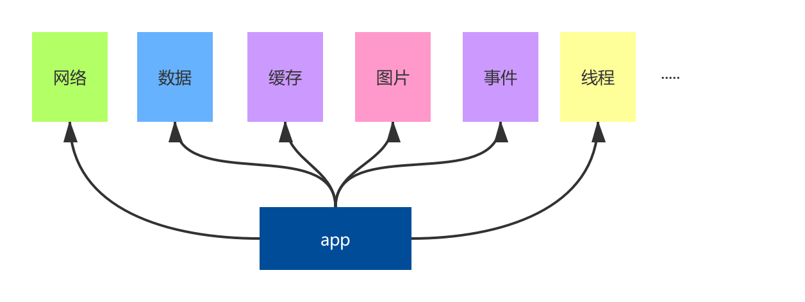
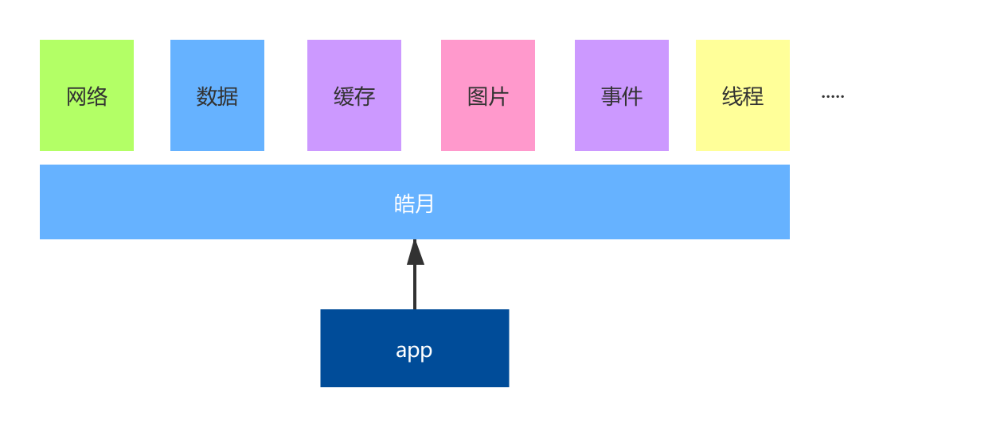
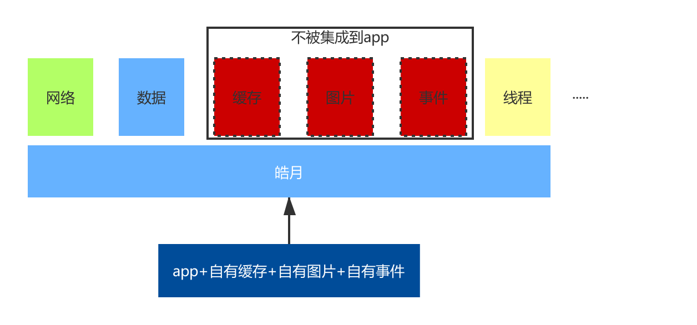
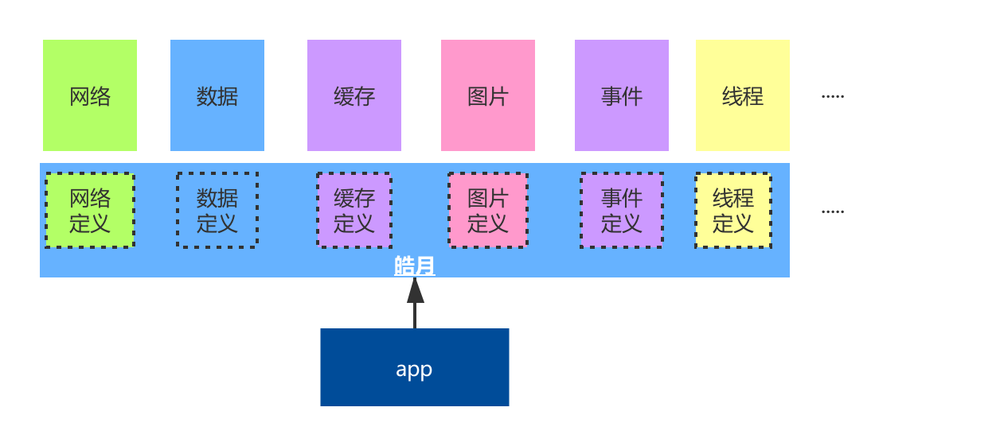
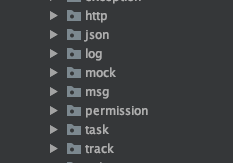
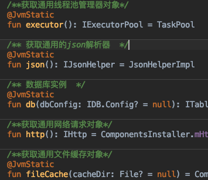
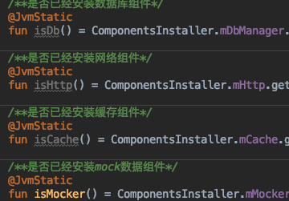

# Kit库
## 1. kit库的由来
在app开发时，绝大数情况下，都需要一些基础能力，例如网络请求，数据存储等。一般的功能依赖如下图所示：

这些基础能力都是app开发的通用能力，我们希望皓月能提供所有必要的基础功能，如图：

但是如此架构会有一些问题，例如app已经集成了缓存功能，不需要皓月中的缓存组件。再例如只是开发一个小的功能模块，只需要网络功能，不需要其他能力。所以，我们希望皓月库能满足依赖最小化的需求，通过依赖配置，自主定义功能组件是否集成。

同时，不同组件之间，可能有一些功能上的依赖。例如我们的缓存库会依赖数据库，网络库会依赖缓存库。我们希望各个组件库之间是透明的，他们不互相耦合。依赖的组件功能是否可用只是通过相关配置是否存在而决定。依赖的组件功能是由谁提供，也是由配置决定。所以我们最终结构如下：

如图所示，**中间的皓月层，在我们的皓月库中被映射为kit组件**，他提供了各个组件的功能定义、组件注册、常用开发工具集。我们约定，子库开发都需要依赖kit库，可以正常使用kit中定义的开发工具集和各种组件功能，但是需要注意是否该功能已被注册，否则将功能无效。我们约定，你可以通过组件的定义规范去桥接自有功能，注册自有组件到皓月框架中。

## 2. 组件接入
要接入一个组件，需要考虑如下几个问题：
1. 在kit中，什么是一个组件？
2. 如何抽象组件定义？
3. 在哪暴露功能，让外部知道我有此功能
4. 组件在哪进行注册？

根据以上四个问题，我们一一进行讨论。

### 2.1. kit中组件的定义
在kit库的由来一节中讲到，我们的每个独立功能都可以看做是一个组件，引用上图：


如上图，第一排的每个功能方块，都是一个组件，都可以在kit中进行抽象定义，再在自己的子库中依赖kit，实现kit中的接口声明。在子库中进行实现时，我们需要提供一个子库入口，方便kit进行自动初始化组件和方便kit提供组件运行环境。在kit中，我们定义`IComponent`接口作为组件标准入口。他的声明如下：

```kotlin
interface IComponent {
    fun init(app: Application) {

        Logcat.register(this)

        init(DefaultEnvironment(app))
    }

    fun init(env: Environment)
}
```

主要定义了两个init方法，用作组件的初始化入口方法。一般情况下只需要关注`fun init(env: Environment)`方法即可，它以运行环境为入参，供组件使用，以及供kit初始化使用。Environment的定义如下：
```kotlin
interface Environment {
    /**app的默认缓存路径*/
    fun appCacheDir(): File

    /**app的默认文件路径*/
    fun appDir(): File

    /**是否是开发模式*/
    fun isDebug(): Boolean

    /**Application包装类*/
    fun application(): IApplication?

    /**当前Context的实例*/
    fun app(): Context
}
```
我们看到，他提供了我们常用的application、context、当前是否为debug和一些文件路径。
实现`IComponent`接口，你就进行了一个组件声明。

### 2.2. 抽象组件定义
皓月组件可以分为两种：需要在kit中声明的十分通用的组件，和基于kit开发，但是不是特别通用的单独组件，例如ocr系列组件。是否需要在kit中进行声明，取决于组件提供的功能是否足够通用。下面我们讨论的组件抽象都是基于在kit中进行声明的组件。

在kit库的由来中我们了解到，我们之所以要做库的能力抽象是为了提供两种能力：通用组件间尽量相互解耦，不互相依赖，和通用组件随时可更换，方便进行功能注册。所以基于以上两点，我们抽象的原则也就很清晰。我们的抽象只要能清楚表达出你的库能力即可，只要能让使用者只关心你的接口api，而不用关心你的实现即可。一般情况下我们在kit组件中，会分出一个个的包给代表每个能力的组件，如图：



你也可以在kit中新建你自己的包来存放你的能力定义。

### 2.3. 进行功能声明
当一个库提供了多种常用功能，给用户一个统一的功能入口，让用户能快速找到想要的功能，是一个可行的办法。在kit库中，我们提供了`CommonSdk`单例类来做这个事情。`CommonSdk`中提供了所有的kit库常用组件功能声明，如图：



当做完自己的实现后，可在此进行声明。我们对于部分简单功能，会在kit中直接实现，例如json解析的封装。对于没有在kit中进行实现，只是在kit中进行了声明的组件，是否有实现库，依赖于是否添加了相关引用依赖。所以对于每个只有声明的api一般会对应一个判断方法，用于给使用方判断，当前kit声明的api是否可用，如图：



至此，你基本就完成了一个组件在kit中的实现、抽象、声明几个步骤，最后我们看一下，一般情况下，如何进行组件注册。

### 2.4. 注册组件
一个组件的存在分两种形式，一种是他属于皓月组件群的一员而存在，一种是他独立存在。当他属于皓月组件群的一员时，用户第一时间感知到皓月框架，我们通过用户初始化kit库而初始化每个子组件。当他是独立存在时，用户第一时间感知到的是组件本身，我们通过用户初始化组件，关联初始化kit库。

我们知道，组件的入口必须实现`IComponent`接口，而一个组件一般应该只有一个入口，所以我们约定，实现IComponent接口的类必须为单例类，必须提供对外的静态实例：INSTANCE。在kotlin实现中，只要实现类为object类型即可，因为他的字节码实现会自动生成一个INSTANCE静态成员变量。在java实现中，需要我们自己提供一个静态成员变量INSTANCE。静态成员变量INSTANCE将作为Kit自动初始化子组件的入口。

我们考虑一下为什么可以是单例？因为我们的IComponent的实现类只是作为组件入口而存在，基本没必要存在多个入口实例，所以我们约定默认为单例实现。在`IComponent`定义中，提供了初始化方法，一般情况下在此方法中进行组件必要的初始化操作和在kit中进行注册操作。kit提供了`ComponentsInstaller`的单例类作为组件的注册入口，你可以在此类中实现自己的注册方法，并在`CommonSdk`中开放组件功能。我们下面以缓存组件为例，看一下注册流程：
* 第一步：抽象缓存组件定义，并新建cache包，将抽象的接口在cache包中声明。
* 第二步：新建缓存组件项目，并引用kit库，实现kit库中的标准接口，并实现相关功能逻辑
* 第三步：在kit库的`ComponentsInstaller`中定义注册入口
    ```kotlin
    /**
     * 初始化硬盘缓存对象，需要调用方自己实现基于[com.meili.moon.sdk.cache]包定义的标准
     *
     * 在使用api之前，必须先调用本方法做初始化
     */
    @JvmStatic
    fun installCache(cache: MoonCache, env: Environment? = null) {
        // 缓存对象
        mCache.setOnceNoError(cache)
        // 尝试初始化kit的上下文
        if (env != null) {
            installEnvInternal(env)
        }
    }
    ```
    
* 第四步：在kit库的`CommonSdk`中提供cache相关api，方便用户查找和使用
    ```kotlin
     /**获取通用文件缓存对象，如果不能确认是否有缓存库，请先调用[isCache]方法进行判断*/
    @JvmStatic
    fun fileCache(cacheDir: File? = null)
    
    /**获取通用缓存对象，如果不能确认是否有缓存库，请先调用[isCache]方法进行判断*/
    @JvmStatic
    fun cache()
    ```

至此，就完成了cache库的注册和实现。

### 2.5. 子组件的自动初始化
在向kit的`ComponentsInstaller`中注册组件时，我们的示例要求使用environment初始化kit，这里有两个作用：
* kit中提供的很多方便的工具api都依赖Application对象，例如通过Application获取某个系统Service之类。所以，要使用kit的工具集，本身就需要提供上下文环境。
* 在设置kit的环境参数时，我们会尝试触发子组件的自动初始化。子组件的收集是通过`moon-kit`插件进行的，收集完成后就可以在运行时自动初始化每个子组件。