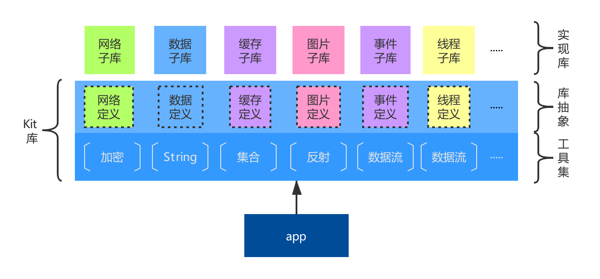
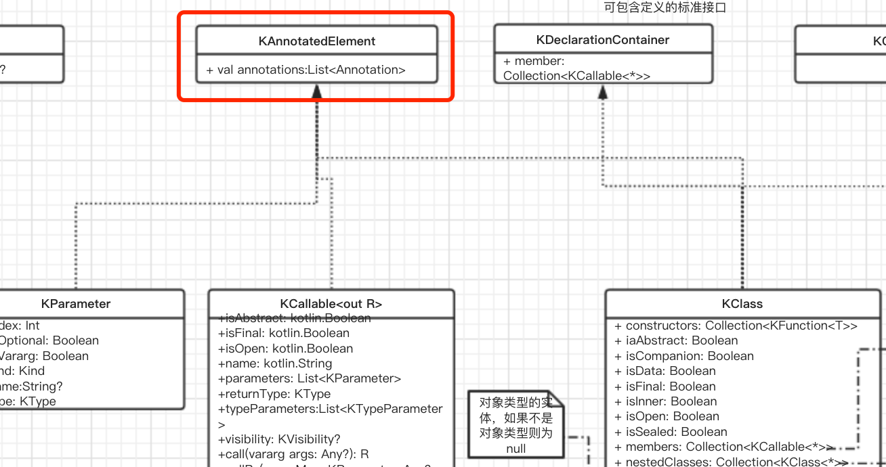

# Kit常用工具集
kit作为皓月其他库的依赖库，提供子库的功能抽象声明，同时还有为子库提供开发常用工具集。

kit库的工具集全部定义在**util**包下。大体分为：加密工具、String工具、collection工具、反射工具、in/output工具、设备信息工具、App工具等，如图：


在开发过程中，有时会遇到一些不好分类的工具方法，但是又比较常用，可临时放到**util/Utils.kt**或者**util/KotlinExtend.kt**文件中，这两个文件暂时没有差别，都是用作存放不好归类的api。待到相关类型的api越来越多后，按照相关维度再做文件拆分。

> 工具方法是否可以放到kit库中，唯一的衡量标准是：是否通用。这个需要我们自己衡量和维护。

## 1. 加密工具
加密常用工具类定义在**util.encrypt**包中。主要包含常用的三种加密编码，分别是：AESUtils、Base64、MD5。

你可以将你需要的更多加密方式在此包中进行扩展。

## 2. String工具
String常用工具类定义在**StringUtil.kt**中。分为字符串的转换、字符串内容判断、字符串和系统交互。常用api如下：
```kotlin
/**转换数组为16进制文本*/
fun ByteArray.toHexString(): String

/**
 * 字符串半角转换为全角
 *
 * 半角空格为32,全角空格为12288.
 * 其他字符半角(33-126)与全角(65281-65374)的对应关系是：均相差65248
 */
fun String.half2Full(): String

/**
 * 是否是以给定的字符串开头，只要满足一个就返回true
 */
fun CharSequence.startWith(vararg prefix: CharSequence, ignoreCase: Boolean = false): Boolean

/***
 * 复制text到黏贴板
 * @return true 复制成功， false 复制失败
 */
fun CharSequence?.copy2Clipboard(): Boolean
```

## 3. 集合扩展工具
集合常用工具类定义在**CollectionUtils_.kt**中，他主要扩展了一些常用foreach，例如：
```kotlin
/**
 * 从0遍历到当前值
 *
 * [include]表示是否包含当前值，默认不包含，如果包含则遍历总数为：当前值+1
 */
inline fun Int.foreach(include: Boolean = false, lambda: (item: Int) -> Unit)

/**
 * 反向遍历一个区间值，也可以直接使用downTo方法
 *
 */
inline fun IntRange.foreachInverse(lambda: (item: Int) -> Unit)

/**
 * 遍历当前集合，入参[lambda]的第一个参数为当前循环的index，第二个参数为当前集合的item对象。
 * 如不需index信息，请参考另外一个[forEach]方法
 */
inline fun <T> SparseArray<T>.forEach(lambda: (index: Int, item: T) -> Unit)
```

你也可以将你常用的集合扩展方法放到这里。

## 4. 反射工具
皓月库中用到了一些反射相关技术，也整理了一些常用反射工具方法，位于**ReflectExtras_.kt**文件中。我们先大概了解一下kotlin中反射类的关系：



更详细的内容，可参照[KotlinReflect解析](https://www.processon.com/embed/5a2dfda6e4b0d8b7bf78d637)

从上图可知，我们常用的**class、function、param**等都是从`KAnnotatedElement`继承而来。所以我们将一些通用方法放到`KAnnotatedElement`类型上进行扩展，例如：
```kotlin
/**
 * 当前KAnnotatedElement是否是一个List
 */
val KAnnotatedElement?.isList: Boolean

/**
 * 当前类型是否是java的基本类型，包括包装的对象类型和基本类型，例如Boolean和boolean
 *
 * 这里的基本类型不包含Void类型
 */
val KAnnotatedElement?.isPrimitive: Boolean

/**
 * 获取当前KParameter的类型class，例如：val a = 1。他的class应该为Int
 */
val KParameter?.clazz: KClass<*>?

/**
 * 获取包含一个泛型的lambda传参中的泛型KClass信息
 *
 * 例如：
 * test<String> {
 * }
 * fun <T> test(lambda: (T)->Unit){
 *      val paramClass = lambda.reflect1Class() // paramClass == String::class
 * }
 */
fun <R : Any> Function<R>?.reflect1Class(): KClass<R>?


/**从一个对象复制相同属性名称的内容到另一个对象，忽略错误*/
fun Any?.copyFrom(from: Any?)

/**
 * 获取匿名内部类的外部引用。一般情况下用于获取lambda表达式的外部实例引用。
 * 在kotlin中，如果lambda表达式，没有直接使用外部类的内容，则lambda中不会持有其引用。
 * 例如：
 * class TestOutClassReference{
 *      fun testLambda(lambda: ()->Unit){
 *
 *      }
 * }
 *
 * class A{
 *      fun test(){
 *          val testOutClass = TestOutClassReference()
 *          testOutClass.testLambda{
 *          }
 *      }
 * }
 * class B{
 *      var value = 3
 *      fun test(){
 *          val testOutClass = TestOutClassReference()
 *          testOutClass.testLambda{
 *              value = 4
 *          }
 *      }
 * }
 * 在上面的例子中：
 * A中的调用，testLambda方法中，没有类A的外部引用，只有匿名内部类的实例引用：INSTANCE。使用此方法获取时，返回值为null。
 * B中的调用，由于在lambda中重新赋值了B.value参数值，所以在testLambda中的入参lambda会持有外部类B的实例引用，可以通过此方法获取到类B对象。
 */
fun <T> Any?.getOutClassInstance(): T?

```

## 5. in/output工具
in/output工具位于util包下的**IOUtil.kt**，此类中定义了一些流相关api：
```kotlin
/**读取inputStream为字符串*/
fun InputStream.readText(charset: String = "UTF-8"): String


/**
 * 在给定的Stream中读取指定字节数
 *
 * 在给定的inputStream中读取[size]个字节，也可以指定跳过[skip]个字节后开始读取
 */
@Throws(IOException::class)
fun InputStream.readBytes(size: Long, skip: Long = 0): ByteArray

/**关闭对象，带有try-catch*/
fun Closeable?.closeIt()

/**获取文件的大小，如果是文件夹则将子文件循环加到一块*/
fun File.lengthRecursively(fileFilter: ((File) -> Boolean)? = null): Long

/**创建一个文件*/
@Throws(IOException::class)
fun String.createFile(): File
```

在这里你还可以补充更多的数据流相关api

## 6. 设备信息工具
kit工具集中封装了常用的设备信息相关工具，位于**DeviceUtil.java**中，需要进一步进行整理和完善，去除不常用工具方法。

## 7. App工具
app工具区别于[设备信息工具](#设备信息工具)，我们期望在其中存放app相关工具方法，而不是设备相关api，例如：
```kotlin
/** 当前代码调用是否处于主进程  */
fun isMainProcess(): Boolean

/**当前代码调用是否处于主线程*/
fun isMainThread(): Boolean
```
