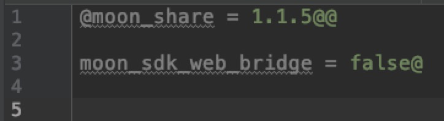
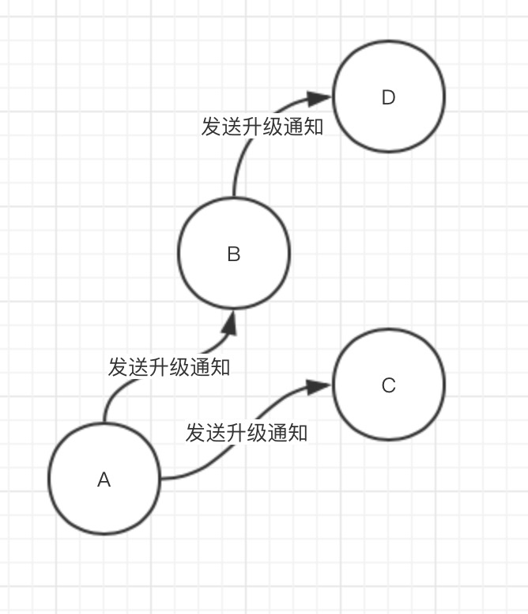
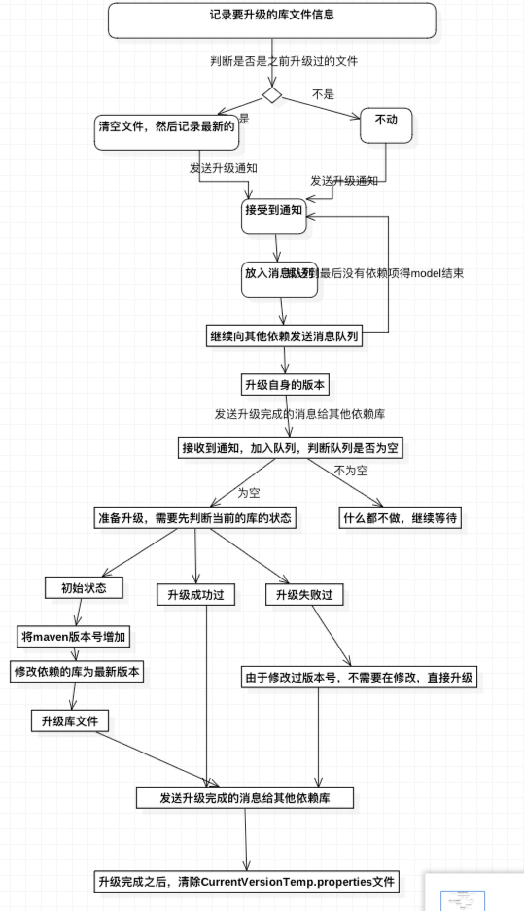

# python升级脚本
由于我们在开发类库的时候，开发完成之后不仅要升级自己的类库，还要将依赖的这个类库的其他类库也要按照关联的先后顺序一一升级，对于这个难题皓月开发了批量升级工具是能够帮助你通过一行命令快速升级版本库和按依赖顺序升级关联的版本库并且上传到maven库中。

# 1.快速集成
将`upload.python`复制到你项目的根目录 [文件](../asset/upload.python)
# 2.使用方式
只需要在`terminal`中输入命令即可。
命令：**`python upload.py 要升级的库的名字`**
例如：`python upload.py moon_share` 升级分享库和依赖分享库的其他库。

# 3.详解
使用插件的时候会生成两个文件`项目名+CurrentVersionTemp.temp`和`HighlibVersionReview.properties`

### 3.1.项目名+CurrentVersionTemp.temp
为升级过程中的临时文件，位于根目录的build下面，记录当前包的版本信息和升级过程中依赖库的成功与失败，如果最终整个链上的库都升级完毕后，会删除该文件，如果升级失败，可以在文件中查看到失败的库是哪个，例如：

代表着生机的库是`moon_share`,失败的库是`moon_sdk_web_bridge`

### 3.2.HighlibVersionReview.properties文件 
在脚本运行的时候会抓取每个库的maven.gradle文件中的MAVEN_ARTIFACT_ID 的版本号最为最新的版本信息记录下来。库文件升级的时候会将build.gradle中依赖的库按照这个表替换为最新的库，然后再去升级。

# 4.错误机制
当你升级库的时候，如果上传失败，只需要修改错误后再次运行脚本即可，会自动帮你跳过已经打包成功的包，然后继续打包直到这个关联的链上库都升级完成，例如 ：
升级的链为 A -> B -> C 
此时 升级失败了说明链中存在错误，一般失败分两种情况 
1. 如果C失败了，修改C 再次升级 则 A 和B 直接跳过，重新打包C
2. 如果C失败了，修改 A ，因为A已经成功打包，但是修改了A，这时候调整了A的版本号，才会再次将A打包，再次升级 则会重新升级整条链上的库

# 5.整体流程
### 5.1准备操作：
先遍历整个文件夹 寻找所有可编译的库lib_list。
然后遍历整个文件夹，初始化所有model的Library的信息
根据输入的要升级的库，去做升级操作。
### 5.2确定升级序列
升级操作 是先发送升级报告给依赖库 收到消息的依赖库，维护一个队列，将收到的消息存储下来准备升级，然后依赖库将向自己要升级的消息继续发送给她的依赖库 直到发送到顶层的的依赖库，这样就确定好整个依赖的升级序列。

### 5.3升级
当确定好升级队列后，先升级第一个版本库
如果是升级依赖的版本库，需要1.先修改maven.gradle中MAVEN_VERSION的版本，默认升级最小的版本号加一，然后2.要将build.gradle中的依赖替换为最新的依赖，
### 5.4发送消息
升级完成之后，发送升级完成的报告给依赖库，收到消息的依赖库，将自己队列中存储的消息清除，然后判断消息队列中是否有其他消息，如果没有其余消息，就开始做自己的升级操作，升级完成之后，继续向他的依赖通知消息，如果有其他消息，就不做任何操作，直到没有消息，才开始升级
### 5.5整体流程图

