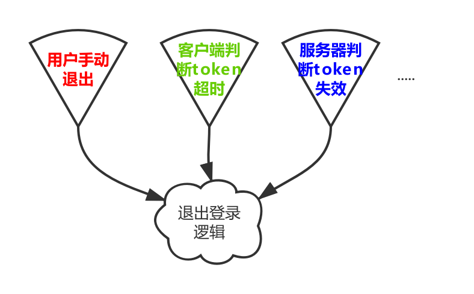

# 皓月中的Task
顾名思义，task是指一个任务。

一个任务，可能是需要耗时的下载大文件，也可能只是用户登录，或者记录一个字段。任务的定义可大可小，大到可以做一系列的业务逻辑，最后完成返回一个Int结果；小到可以只是在SharedPrefrence中记录一个值。一个任务被定义出来，他往往就是可通用的，或者是被声明的。用地地方多了，自然就是一个通用的任务，例如：用户退出登录的逻辑，可能会在多种情况下触发，如下



你可以将上图中的退出登录逻辑提取为一个公用方法，大家都调用此方法即可；这种方式简单易用，同时也有很不错的可维护性。如果我们将客户端上的组合结构再扩展一点，将功能独立的逻辑代码使之组件化；当各个功能组件化以后，就面临通用任务如何共享的问题；可能在不同的组件中，都有对退出登录的需求，这时如果只是在某个组件方法中定义，就不好做到功能通用；如果将此方法下沉到基础库，而随着业务不断扩展和代码不断增加，基础库会不断膨胀，最终不得不进行拆分。

皓月针对类似问题，以声明的Task做业务处理，并通过Message的方式解耦组件通用功能。下面我们讨论一下在皓月中如何定义和使用Task。

## 1. 快速引入
由于实现很轻量，所以抽象和实现都在kit库中，引入kit库就集成了此功能。具体kit库的引入方式请参见：[kit引入文档](/../kit/kit_import.md)

-------

## 2. 开始使用
Task相关的使用，大体分两步：定义并注册Task和启动Task
## 2.1. 定义和注册Task
要定义一个Task需要继承`MessageTask`。从`MessageTask`中，可以获取到启动此Task时的用户入参，以便在处理逻辑时使用。例如我们定义一个用户退出登录的Task，如下：
```kotlin
/**
 * 用户退出登录Task
 */
class LogoutTask(msg: BaseMessage) : MessageTask<Boolean>(msg) {

    /**task任务执行*/
    override fun doBackground() {
        // 是否清除本地的通用信息
        val isClearCommonInfo = arguments.getBoolean("isClearCommonInfo")

        // 第一步：通知服务器退出登录
        // 第二步：清除本地的登录信息
        // 第三步：根据入参，判断是否清除通用信息
        // 第四步：设置退出登录结果
        setResult(true)
    }
}
```
在上例中我们看到，`MessageTask`上有个`<Boolean>`泛型，他的含义是此Task的结果是Boolean类型。我们还看到`arguments.getBoolean("isClearCommonInfo")`，其中`arguments`成员变量就是用户启动Task时的入参`Bundle`。

下面我们将定义的task，在`MessageRegistry`中进行注册：
```kotlin
MessageRegistry.register("common/logout", LogoutTask::class.java)
```
在上述代码中，注册方法第一个参数为当前Task的消息Id，此Id在App内不可重复。后面需要使用此id启动退出登录Task。

到此，我们定义了用户退出登录的Task，并将它在皓月的task管理中进行了注册。

## 2.2. 启动Task
要启动我们前面定义的`LogoutTask`，需要一个新的对象：`BaseMessage`。他负责收集当前的用户参数和设置结果回调，例如：
```kotlin
// task的启动入参
val taskArgs = Bundle()
taskArgs.putBoolean("isClearCommonInfo", true)

// 新建一个退出登录Id的的消息体
val logoutMsg = BaseMessage("common/logout")
// 设置入参
logoutMsg.arguments = taskArgs
logoutMsg.setCallback(object : MessageCallback<Boolean>() {
    override fun onSuccess(result: Boolean) {
    }
    override fun onError(exception: BaseException) {
    }
    override fun onFinished(isSuccess: Boolean) {
    }
})
    
// 发送消息，启动任务，并得到一个可取消对象，用来取消任务
val cancelable = logoutMsg.send()
```

至此我们就定义、注册、启动了一个Task。