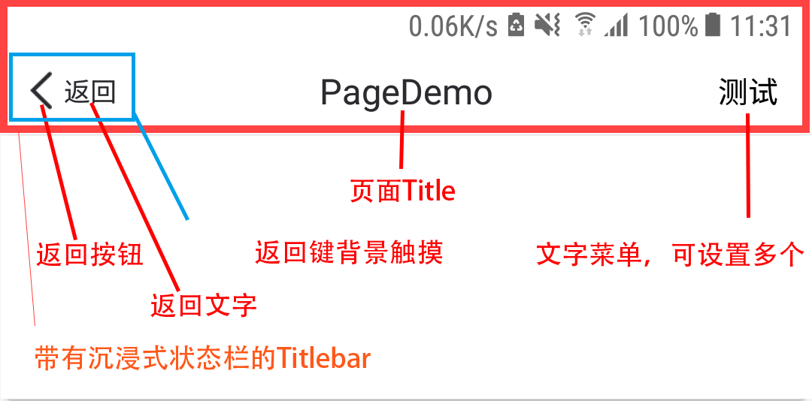

# RainbowFragment
**RainbowFragment**作为路由库的基础页面使用，当前路由管理的所有页面都是基于**RainbowFragment**开发。

**RainbowFragment**主要提供的功能有：**声明周期相关、交互相关**。

## 1. 生命周期
**RainbowFragment是Fragment的子类**，他自身有Fragment相关生命周期。但是Fragment生命周期在堆栈管理中，回调不稳定，容易出现错误，同时也为了给框架留有更多的扩展空间。所以Rainbow中禁用了大部分系统生命周期，并提供了相对稳定的生命周期，这些生命周期都定义在**PageLifecycle**中，主要方法如下：
``` kotlin
/**
 * 当页面已经创建 回调方法
 * 一般用作初始化页面控件、逻辑、数据等操作
 */
fun onPageCreated(view: View, savedInstanceState: Bundle?)

/**
 * 当页面由后台跑到前台 回调方法
 * 一般用于实现依赖页面展示时机的操作
 */
fun onPageResume()

/**
 * 当页面正在销毁，在[onPageDestroyView]后,[onPageDetach]前 回调方法
 * 一般用作回收页面对象、属性等内容
 */
fun onPageDestroy()
```
除了上述常用的三个声明周期方法，还有其他更多方法，可参考**PageLifecycle**接口定义。
在RainbowFragment中**onPageCreated()**方法是必须实现的方法，用于进行页面的主要初始化逻辑，例如设置点击事件、请求服务器接口、初始化控件内容等等，相当于Activity的**onCreate()**方法。

### 1.1. RainbowFragment中状态判断
在处理页面事件时，我们需要关注页面当前状态是否可做交互操作，以避免一些意外情况发生。例如，当页面正在loading，用户点击了页面标题栏的菜单按键，此时页面还不可以交互，否则可能出错。在RainbowFragment中，我们定义了**Interactive接口**，用来说明当前对象是否可以交互，具体定义如下：
``` kotlin
/**
 * 当前可交互的标准接口
 */
interface Interactive {
    /**是否可交互 true：可交互  false：不可交互*/
    var interactive: Boolean
}
```
一些基类，或者通用方法，可以通过判断对象的**interactive**值来判断当前对象是否可交互，从而有检验标准的同时，不用强依赖RainbowFragment。

同样，在处理异步回调时，我们也标准化了当前页面是否已被销毁的接口，如下：
``` kotlin
/**
 * 当前对象是否已经被销毁，可销毁对象的标准化接口
 */
interface IDestroable {
    /**
     * 当前对象是否已经被销毁，true 已销毁，false 未销毁
     */
    var hasDestroyed: Boolean
}
```
RainbowFragment实现了此接口，减轻了一些扩展方法对**RainbowFragment**类的依赖，可通过**IDestroable对象**进行销毁判断。

在RainbowFragment中，提供了一些类似Activity的状态判断方法，例如：**isFinishing()**页面是否正在结束、**isPaused()**页面是否已经处于paused状态、**isFront()**页面是否在栈顶等

## 2. 相关交互
RainbowFragment提供了一个页面最常用的一些交互，主要有：**Titlebar、PageStatesView、PageNotification**。
### 2.1. Titlebar
**RainbowFragment默认集成了Titlebar**。Titlebar提供了**返回按钮、页面名称、页面菜单**三个常用主要功能，效果如下：


Titlebar的功能可以通过Rainbow中的api直接控制，如**关闭默认Titlebar**：
``` kotlin
/**
 * 重写是否使用默认Titlebar，禁用默认Titlebar。默认情况使用Titlebar
 */
override fun isUseDefaultTitleBar() = false
```
**将默认Titlebar设置为自定义的Titlebar**：
``` kotlin
/**
 * 当页面已经创建 回调方法
 */
fun onPageCreated(view: View, savedInstanceState: Bundle?) {
    // mTitleBar是RainbowFragment中声明的成员变量，Rainbow中的Titlebar相关接口都针对此对象操作
    mTitleBar = specialTitlebar
}
```
> mTitleBar是RainbowFragment中声明的成员变量，Rainbow中的Titlebar相关接口都针对此对象操作。

**设置页面名称**，如下：
``` kotlin
/**
 * 当页面已经创建 回调方法
 */
fun onPageCreated(view: View, savedInstanceState: Bundle?) {
    setTitle("个人中心")
}
```
**添加文字菜单**：
``` kotlin
/**
 * 当页面已经创建 回调方法
 */
fun onPageCreated(view: View, savedInstanceState: Bundle?) {
    addMenuText("MenuText") {
        // Menu的点击事件
    }
}
```
**添加Icon菜单**：
``` kotlin
/**
 * 当页面已经创建 回调方法
 */
fun onPageCreated(view: View, savedInstanceState: Bundle?) {
    addMenuIcon(R.drawable.menu_icon) {
        // Menu的点击事件
    }
}
```
更多菜单设置，可参考**ITitleBarView接口**定义。ITitleBarView接口定义了Titlebar的主要常用功能，RainbowFragment默认使用的Titlebar就是其子类：**RainbowTitleBarView**。它可以使用通过主题进行样式自定义，具体支持的内容如下：
``` xml
<declare-styleable name="RainbowTitleBarView">
    <!--        设置titlebar背景颜色-->
    <attr name="rainbowTitleBarBackground" format="color|reference" />
    <!--        设置头部padding，这个padding会按照状态栏自动修正-->
    <attr name="rainbowTitleBarPaddingTop" format="dimension" />
    <!--        设置返回键的背景资源-->
    <attr name="rainbowTitleBarBackBg" format="reference" />
    <!--        设置返回键的最小触发宽度-->
    <attr name="rainbowTitleBarBackMinWidth" format="dimension" />
    <!--        设置返回键的样式资源-->
    <attr name="rainbowTitleBarBackSrc" format="reference" />
    <!--        设置返回键文字颜色，接收一个colorStateList，满足交互变色-->
    <attr name="rainbowTitleBarBackTxtColor" format="reference" />
    <!--        设置返回键文字大小-->
    <attr name="rainbowTitleBarBackTxtSize" format="dimension" />
    <!--        设置返回键默认文字，默认为空-->
    <attr name="rainbowTitleBarBackTxt" format="reference|string" />
    <!--        设置Title文字颜色-->
    <attr name="rainbowTitleBarTitleColor" format="color" />
    <!--        设置Title文字大小-->
    <attr name="rainbowTitleBarTitleSize" format="dimension" />
    <!--        设置Menu文字颜色-->
    <attr name="rainbowTitleBarMenuTextColor" format="color" />
</declare-styleable>
```
这些style可以通过主题进行通用配置。在主题中RainbowTitleBarView接收**rainbowTitleBarView属性**，rainbowTitleBarView属性值指向你的**自定义style**，例如：
``` xml
<!-- Application的主题 -->
<style name="AppTheme" parent="RainbowAppTheme">
    <!--  在主题中设置Titlebar的自定义样式-->
    <item name="rainbowTitleBarView">@style/SelfRainbowTitleBarView</item>
</style>

<!-- 自定义Titlebar样式-->
<style name="SelfRainbowTitleBarView">
    <item name="rainbowTitleBarBackground">#ff0000</item>
    <item name="rainbowTitleBarPaddingTop">5dp</item>
    <item name="rainbowTitleBarBackBg">@drawable/ic_launcher</item>
    ...更多其他属性
</style>
```
> 在某些情况，你需要单独设置Titlebar的样式，例如透明主题，可以通过Titlebar的**setStyle()**方法进行自定义，此方法也接收**RainbowTitleBarView**中定义的属性设置。

### 2.2. PageStatesView
页面在使用过程中，通常包含多种状态，例如：加载中、加载失败、加载内容为空、加载成功等等。在RainbowFragment中，归纳了这些常用状态，并实现了**PageStatesView控件**，用来承载这些状态。**RainbowFragment默认内置PageStatesView**。PageStatesView的默认状态为隐藏，你可以根据业务需要调用相应api进行状态切换。
#### 2.2.1. 常用api
在RainbowFragment包含一个**mStateView**成员变量，用来管理PageStatesView。可以通过重写**isUseDefaultPageStatesView()**方法，来定制是否加载默认PageStatesView，如下：
``` kotlin
/**是否使用默认的pageStatesView，如果要自己实现，可返回false*/
override fun isUseDefaultPageStatesView() = true
```
**显示loading状态view**，如下：
``` kotlin
mStateView.showLoading()
```
**显示错误状态view**，如下：
``` kotlin
mStateView.showError()
```
**显示空内容状态view**，如下：
``` kotlin
mStateView.showEmpty()
```
**隐藏PageStatesView**，如下：
``` kotlin
mStateView.gone()
```
**监听特定状态下的状态View点击**，如下：
``` kotlin
// 设置错误状态View的点击事件回调
mStateView.setOnStateClickListener(PageStatesView.STATE_ERROR) {
}
```
由于错误、空这两种状态是经常需要鉴定点击事件，从而做刷新等操作的状态，所以我们提供了两个便捷方法，如下：
``` kotlin
// 设置错误状态View的点击事件回调
mStateView.setOnErrorClickListener {
}
// 设置空状态View的点击事件回调
mStateView.setOnEmptyClickListener {
}
```

#### 2.2.2. 自定义PageStatesView中的状态View
在我们开发时，有可能需要自定义状态对应的View，在**PageStatesView**中，提供了几种常用Int类型的状态，分别对应一个**PageStateItemView**类型的View，再通过不同的show方法展示指定状态对应的View。**PageStateItemView是各个子状态View的真正实例载体。**PageStateItemView类中提供了一个**AbsStateItemView类**，用来简化StateItemView的实现。下面，我们使用AbsStateItemView来自定义实现一个Error状态View。
* 第一步：**继承AbsStateItemView来实现自己的View**，并实现其中的抽象方法
``` kotlin
open class PageStateErrorView(parent: ViewGroup) : PageStateItemView.AbsStateItemView(parent) {
    /**页面的layout资源id*/
    override fun getLayoutId(): Int = 当前View需要加载的layoutId
    
    // 当前页面对应的状态
    override val state: Int = PageStatesView.STATE_ERROR
    
    // 当前页面的Params
    override var stateParams: PageStateParams = Params()

    override fun notifyParamChange() {
        super.notifyParamChange()
        // 使用stateParams中的参数，对当前view进行显示设置。
    }

    // 自定义的当前页面param类
    class Params : PageStateEmptyView.Params() {
        /**提示的文案*/
        override var tipText: CharSequence = "出错了😭"
    }
}
```
如上述代码所示，在一个State中，会对应实现一个Params，用来接收和初始化默认参数。
在错误状态时，我们通常关心错误页面的点击事件，用以提供给外部进行页面刷新等操作，所以我们需要重写getOnClickView()方法，用来提供点击事件的View，如下：
``` kotlin
// 提供错误页面的button作为点击View
override fun getOnClickView(): View = mTxtPageStateErrorReload
```
* 第二步：**在PageStatesView中添加自定义StateItemView到指定状态**，如下：
``` kotlin
mStateView.addStateView(PageStateErrorView(mStateView))
```
* 第三步：**使用自定义PageStateItemView**。如果你的自定义View使用的是**预置状态**，那么可以直接使用原有show方法即可展示切换，如果是**新增状态**，需要使用show(state)方法进行展示，如下：
``` kotlin
// 我们自定义的状态View是使用的预置STATE_ERROR
mStateView.showError()
```

#### 2.3. 页面内Notification
页面内Notification的作用和Toast相似，从页面的titlebar下弹出，可以设置文案等内容，效果如下：
<image src="media/page_notification.png" width=80% height=80%>

##### 2.3.1. 使用方式
Rainbow提供了三种状态的PageNotification，分别是：**默认、成功、失败**。在RainbowFragment中对应的使用方式如下：
``` kotlin
// 默认的页面通知
showNotification("页面内通知示例：默认")
// 表示失败的页面通知
showNotificationFailed("页面内通知示例：错误、失败")
// 表示成功的页面通知
showNotificationSuccess("页面内通知示例：成功、通过")
```
下面，我们简单看一下**showNotification()**方法的定义，以及扩展使用，如下：
``` kotlin
/**
 * 显示一个notification，默认2秒关闭
 *
 * 如果设置 关闭时间 <= 0，则认为不自动关闭，页面通知会常驻顶部，直到调用dissmiss方法。
 * 当常驻显示并且设置了点击事件，则会自动显示右边的箭头，否则自动隐藏，除非单独设置
 */
fun RainbowFragment.showNotification(msg: CharSequence, delayDismissSecond: Int = 2,
                                     onClickCallback: OnClickCallback = null)
```
根据如上api我们可知，我们可以**自定义通知展示时间和通知的点击事件**。如果我们设置的**展示时间小于等于0，则页面通知就成了常驻形式**。在常驻形式下，如果**设置了他的点击事件，则会自动展示通知末尾的箭头图标**，用来引导用户点击。

##### 2.3.2. 自定义样式
Rainbow支持**在主题中定义页面通知样式**，具体的定义方式如下：
``` xml
<style name="SelfTheme" parent="RainbowAppTheme">
    <!--定义默认页面通知样式-->
    <item name="moonRainbowNotificationNormal">@style/selfNotificationNormal</item>
    <!--定义失败页面通知样式-->
    <item name="moonRainbowNotificationFailed">@style/selfNotificationFailed</item>
    <!--定义成功页面通知样式-->
    <item name="moonRainbowNotificationSuccess">@style/selfNotificationSuccess</item>
</style>
```
在**主题中属性引用的Style中**，具体可自定义属性如下：
``` xml
<!--PageNotification的样式-->
<declare-styleable name="RainbowPageNotification">
    <!--设置页面通知的文字颜色-->
    <attr name="rainbowPageNotificationTextColor" format="color|reference" />
    <!--设置页面通知的文字大小-->
    <attr name="rainbowPageNotificationTextSize" format="dimension" />
    <!--设置页面通知的背景颜色-->
    <attr name="rainbowPageNotificationBackgroundColor" format="color|reference" />
    <!--设置页面通知的箭头资源-->
    <attr name="rainbowPageNotificationArrow" format="reference" />
    <!--设置页面通知的icon资源-->
    <attr name="rainbowPageNotificationIcon" format="reference" />
    <!--设置页面通知的高度-->
    <attr name="rainbowPageNotificationHeight" format="dimension" />
</declare-styleable>
```